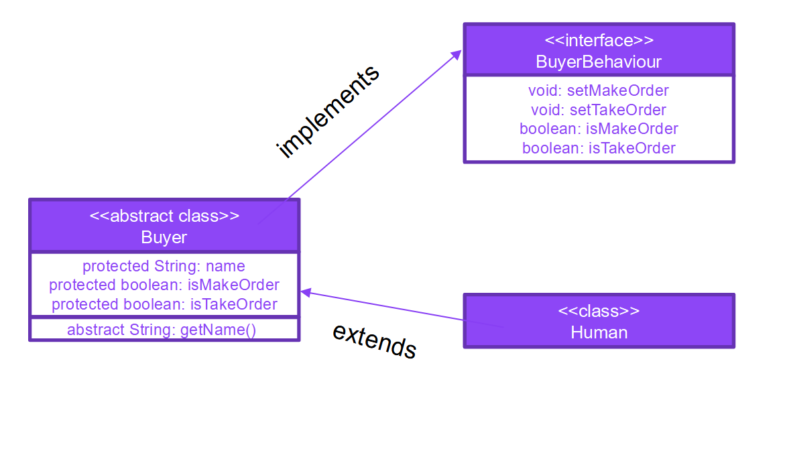
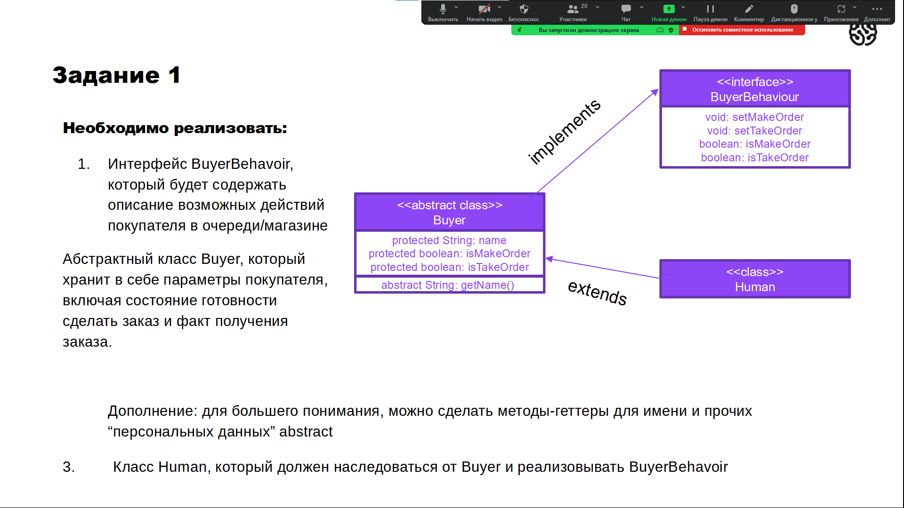
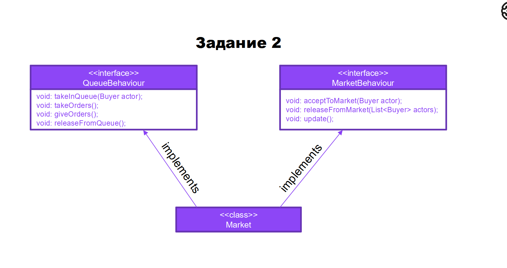

# Seminar_2

1.

2.(Перенесено в hw)

# Homework(Seminar_2)
-------------------------------Для тех, кто не реализовал интерфейсы с вебинара------------------------------
Реализовать класс Market и все методы, которые он обязан реализовывать.
Методы из интерфейса QueueBehaviour, имитируют работу очереди,
MarketBehaviour – помещает и удаляет человека из очереди, метод update – обновляет состояние магазина (принимает и отдает заказы)
-------------------------------Для тех, кто работал в группе------------------------------

Рефакторинг любого из дз с курса по java с учетом принципов ООП